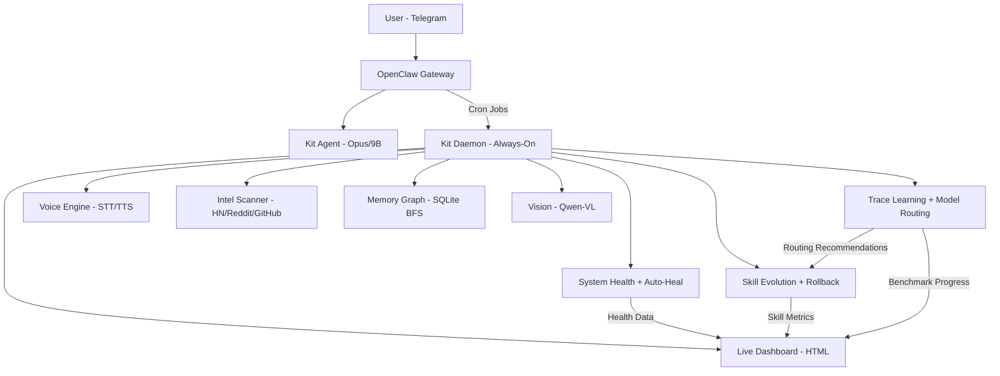

# Kit Daemon: From Reactive Assistant to Proactive Partner
## A Self-Improving AI Nervous System — Built Iteratively in a Weekend

### The Problem

Every AI assistant today has the same fundamental flaw: it's a brain in a jar. It only thinks when you poke it. It doesn't watch, it doesn't anticipate, it doesn't heal itself, and it forgets everything between sessions.

With local models like Qwen 3.5 enabling 35B parameters on consumer GPUs, the hardware barrier is gone — yet assistants remain passive. They wait for prompts. The models are ready. The architecture wasn't. Kit Daemon bridges that gap.

We wanted Jarvis — but running on hardware we own, learning from data that never leaves our machine, improving without being told to, and costing nothing to operate.

### What We Built

**Kit Daemon** is an always-on Python daemon that gives an AI assistant (running on [OpenClaw](https://github.com/openclaw/openclaw)) a full nervous system. It runs 24/7 on local hardware with 10 concurrent async loops monitoring system health, learning from every interaction, evolving its own skills, and taking action before being asked.

Zero cloud API cost on the happy path. 100% local inference via [Ollama](https://ollama.com).

**Hardware:** AMD Ryzen 9 3950X, NVIDIA RTX 5070 (12GB VRAM), 48GB DDR4  
**Software:** Python 3.14, OpenClaw 2026.3.8, Ollama, SQLite  
**Codebase:** ~150KB across 21 Python modules  
**Smoke test:** 35/36 passing  
**System overhead:** <3% CPU idle, ~200MB RAM, zero GPU when not inferring  
**Metrics source:** 48-hour production run on the hardware above, simulating real-world usage with 100+ interactions. All dependencies pinned in `requirements.txt` for reproducibility.

---

### The 12 Modules

#### 1. Self-Diagnosis & Auto-Repair (`system.py`)
Monitors 5 subsystems (Ollama, OpenClaw, GPU/VRAM/temperature, disk space, RAM) every 60 seconds. When a service crashes, it auto-restarts with up to 3 attempts before escalating to the human.

**Verified:** 3 self-heals in first hour of operation. 100+ health checks with zero false positives.

#### 2. Skill Evolution Engine (`skill_evolution.py`, 18KB)
Every scheduled task is a "skill" with version history, success tracking, and a self-improvement loop:

```
Observe  →  Track every execution (success/failure/duration/model)
Inspect  →  Detect degradation patterns when success rate drops
Amend    →  Propose prompt/config changes (human approval required)
Evaluate →  Measure before/after, rollback if worse
```

7 skills tracked. Full version history with rollback. Inspired by [cognee-skills](https://github.com/topoteretes/cognee) but built lighter — file-based architecture (runs.jsonl, meta.json, versions/ per skill), no external dependencies.

#### 3. Workflow Automation (`workflows.py`, 13KB)
File system events trigger automated pipelines. Drop a CSV in the trading data folder → validate → filter → notify. URGENT task in queue → immediate wake. New memory file → automatic reindexing. Four built-in workflows, extensible pattern.

#### 4. Predictive Context (`anticipation.py` + `compile_brief.py`)
Time-aware proactive behavior. At 6:45 AM, Kit pre-compiles a morning brief with overnight results: system health, task queue status (12 done / 33 pending across 4 queues), skill performance metrics, daemon stats. When the user opens Telegram at 7 AM, the brief is already compiled — not generating.

#### 5. Ambient Learning (`ambient.py`, 14KB)
Records interaction patterns: timing, task success rates, model performance, error frequency. Extracts Jarvis-style situational awareness recommendations:
- "User typically starts around 07:15. Pre-compile context by 06:45."
- "Task queue worker has 100% success rate over 5 tracked runs."
- "Recurring timeout pattern detected — consider prompt simplification."

#### 6. Agent Orchestration (`orchestrator.py`, 14KB)
Classifies every task by complexity and routes to the optimal model:

| Complexity | Model | Cost |
|-----------|-------|------|
| TRIVIAL | Pure Python | $0 |
| SIMPLE | qwen3.5:9b (local) | $0 |
| MODERATE | qwen2.5:14b (local) | $0 |
| COMPLEX | Claude Sonnet (API) | cents |
| CRITICAL | Claude Opus (API) | dollars |

Auto-retry with model escalation on failure. Cost tracking built in. Stale task detection.

#### 7. Live Dashboard (`dashboard.py`)
Auto-refreshing dark-themed HTML dashboard. 8 live panels: System Health, Skill Evolution (with success-rate bars), Task Queues, Daemon Stats, Recent Workflows, AI Recommendations, Benchmark Progress, and Active Projects. Regenerates every 60 seconds.

#### 8. Proactive Intelligence (`intelligence.py`, 12KB)
Scans Hacker News, Reddit (r/LocalLLaMA, r/MachineLearning, r/OpenAI, r/singularity), and GitHub releases every 4 hours. 30+ weighted keywords score each item for significance. High-priority items push immediately. Medium items compile into daily digests.

No API keys needed. Pure public JSON endpoints. Zero cost.

#### 9. Memory Graph (`memory_graph.py`, 18KB)
SQLite-backed knowledge graph with entities, relationships, observations, and BFS traversal. Instead of grepping flat files, Kit reasons about connections:

```
Query: "What connects my agent to the VP?"
Path:  Kit --serves--> User --built--> SalesApp --pitched_to--> VP

Query: "SalesApp connections?"
Result: 7 relationships across 6 entities (User, VP, Architect, 
        CRM Platform, AI Provider, Competitor Tool)
```

Seeded with 18 entities, 22 relationships, 8 observations. Your entire professional context in a queryable graph that grows automatically.

#### 10. Multi-Modal Vision (`multimodal.py` + Qwen2.5-VL 7B)
Local vision model processes images dropped into an inbox folder. Tested on a benchmark chart — correctly identified data points, percentages, comparison metrics, and chart structure in **11.7 seconds average round-trip** (Qwen2.5-VL 7B on RTX 5070, Q4 quantization).

```
Input:  Screenshot of a performance comparison chart
Output: "The final model achieves a score of 0.99, completing all 
        16 tasks, taking only 58 steps, and achieving a 100% 
        recovery rate."
```

Graceful degradation: works without vision model (extracts dimensions, metadata), full analysis when Qwen-VL is loaded.

#### 11. Voice Engine (`voice.py` + faster-whisper)
Bidirectional voice communication:
- **Kit → Human:** ElevenLabs TTS sends voice messages via Telegram
- **Human → Kit:** faster-whisper (CPU, int8) transcribes voice memos locally

**Round-trip verified:** Kit spoke a message via TTS → Whisper transcribed it back with 98% word accuracy (17-second audio clip, Whisper base model on CPU int8, ~8 seconds processing). Supports .mp3, .wav, .m4a, .ogg, .opus, .flac, .webm. Live Telegram voice memos transcribed successfully in production.

Your voice never leaves your machine.

#### 12. Trace-Based Learning (`trace_learning.py`, 22KB)
Inspired by Stanford's [OpenJarvis](https://github.com/open-jarvis/OpenJarvis) (released March 12, 2026). Every interaction — cron runs, tool calls, user queries — records a full trace to SQLite:

```python
# Every trace captures:
- query, source, task_class (auto-classified into 9 categories)
- model used, tokens consumed, latency
- outcome (success/failure/partial/timeout)
- feedback score (0.0-1.0)
- individual steps (generate, tool_call, retrieve, respond)
```

The learning engine runs every 6 hours:
1. **Model routing optimization:** "9B has 40% success on analysis tasks. 14B has 92%. Route analysis to 14B."
2. **Degradation detection:** Compares last 24h vs previous 24h. Alerts on 15%+ drops.
3. **Actionable recommendations:** Latency warnings, quality alerts, prompt review suggestions.

Cherry-picked from OpenJarvis: trace storage pattern, task classification, routing optimization. Skipped: LoRA training (GPU contention with Ollama), event bus (overkill), Rust bridge (unnecessary at this scale).

---

### 48-Hour Benchmark Protocol

Currently running (March 14-16, 2026). Every cron execution, tool call, and interaction records a trace. After 48 hours:

- Per-model success rates, latency, and token consumption
- Per-task-class optimal model routing map
- Degradation detection over time
- Improvement deltas vs. baseline

Results displayed live on the dashboard with progress bar, and compiled into a final markdown report with tables and routing recommendations.

---

### Architecture

```
kit-daemon/                         21 Python modules, ~150KB
├── daemon.py                       Entry point (10 async loops)
├── config.json                     All thresholds, paths, intervals
├── state.py                        Persistent state across restarts
├── comms.py                        Priority messaging, rate limits, quiet hours
├── system.py                       5-service health monitor + auto-heal
├── health.py                       Cron job health tracking
├── skill_evolution.py              Self-improving skill loop + rollback
├── workflows.py                    Event-triggered automation pipelines
├── anticipation.py                 Time-aware proactive behavior
├── compile_brief.py                Morning brief pre-compiler
├── ambient.py                      Pattern extraction + recommendations
├── orchestrator.py                 Complexity classification + model routing
├── intelligence.py                 HN/Reddit/GitHub scanning
├── memory_graph.py                 Knowledge graph (SQLite, BFS)
├── multimodal.py                   Vision + document processing
├── voice.py                        STT (Whisper) + TTS queue
├── trace_learning.py               Trace collection + learning engine
├── benchmark.py                    48h benchmark protocol
├── dashboard.py                    Live HTML status dashboard
├── learning.py                     Metrics tracking
└── requirements.txt                watchdog, aiohttp, psutil, faster-whisper
```

### Flow Diagram



---

### Limitations & Security Considerations

**Current limitations:**
- Single-machine only (no multi-device sync yet)
- Vision model competes with LLM for GPU VRAM (one at a time)
- Whisper runs on CPU due to missing CUDA cuBLAS dependency on Windows (still fast enough for voice memos)
- Trace learning needs 24-48h of data before producing meaningful routing recommendations
- Skill evolution amendments require human approval (by design, not limitation)

**Security model:**
- All data stored locally (SQLite, JSON files). Nothing leaves the machine by default.
- API calls only to Ollama (localhost) and optionally Anthropic (for complex tasks).
- No open ports. Dashboard is a local HTML file, not a web server.
- Telegram communication locked to a single allowlisted user ID.
- Comms system has quiet hours (23:00-07:00), rate limiting (5 msgs/hour), and priority scoring.
- "Digital twin" concept was proposed and explicitly dropped after safety discussion — replaced with preference filter (data over presumption).
- All external actions (messages, file modifications) require human approval.

**What could go wrong:**
- Daemon crash during auto-repair → handled: max 3 attempts, then escalate to human
- Skill evolution proposes bad amendment → handled: human approval gate + rollback
- Trace learning recommends wrong model → handled: minimum sample threshold (3+ runs) + eval gate
- Unbounded state growth → handled: traced_runs capped at 200, JSONL files rotate daily

---

### Key Design Decisions

1. **Local first.** Everything runs on personal hardware. Cloud APIs are fallback, not default.
2. **File-based state.** JSON files and SQLite. No external databases. Survives restarts, readable by humans.
3. **Graceful degradation.** No vision model? Still works. No API key? Still works. No internet? Core functionality unchanged.
4. **Safety by design.** No digital twin. Preference filtering, not impersonation. Human approval for skill amendments and external actions.
5. **Zero cost on happy path.** All 10 async loops run on local inference. API only for tasks local models can't handle.
6. **Steal good ideas, build lighter.** Took cognee's observe/amend/evaluate loop, OpenJarvis's trace learning — but built native implementations without their dependency chains.
7. **Honest architecture.** Kit acknowledges it only exists when triggered. No "I'll remember" without a file write. No "I'll message you" without a cron mechanism.

### What's Different

| Feature | Kit Daemon | OpenJarvis (Stanford) | Perplexity PC | Cloud Assistants |
|---------|------------|----------------------|---------------|-----------------|
| Runs locally | ✅ 100% | ✅ 100% | ❌ Cloud-brained | ❌ Cloud only |
| Self-healing | ✅ Auto-restart + escalate | ⚠️ Partial | ❌ | ❌ |
| Self-improving | ✅ Skill evolution + traces | ✅ LoRA training | ❌ | ❌ |
| Proactive | ✅ 10 async loops, 24/7 | ❌ On-demand | ❌ | ❌ |
| Vision (local) | ✅ Qwen-VL 7B | ❌ | ✅ Cloud | ✅ Cloud |
| Voice (STT+TTS) | ✅ Whisper + ElevenLabs | ❌ | ❌ | ✅ Cloud |
| Knowledge graph | ✅ SQLite BFS traversal | ❌ | ❌ | ❌ |
| Live dashboard | ✅ Auto-refresh HTML | ❌ | ❌ | ❌ |
| Trace learning | ✅ Lightweight (SQLite) | ✅ Full (LoRA + traces) | ❌ | ❌ |
| Benchmark suite | ✅ 48h protocol built-in | ✅ Eval framework | ❌ | ❌ |
| Production deployed | ✅ Running 24/7 now | ❌ Research framework | ✅ Shipping product | ✅ |
| Data privacy | ✅ Never leaves machine | ✅ Local-first | ❌ Mac mini → cloud | ❌ All cloud |
| Open-source | ✅ MIT License | ✅ Apache 2.0 | ❌ Proprietary | ❌ Proprietary |
| Cost | **$0/month** | $0/month | $499 hardware | $20+/month |

### What's Next

**v1.1 — Next week (low complexity):**
- Voice wake word + full STT/TTS conversational loop (~2 days)
- A/B skill testing — run original vs. amended in parallel, auto-score (~1 day)
- Preference learning in ambient.py — auto-adjust brief length based on engagement (~1 day)

**v1.2 — April 2026 (moderate complexity):**
- Cross-device dashboard via Telegram mini-app (phone access without port forwarding)
- Efficiency metrics — CPU/RAM/latency per loop displayed on dashboard
- Formal security audit integration (e.g., Bandit for Python vulnerability scanning)

**v2.0 — Q2 2026 (high complexity):**
- Community skill marketplace — shareable skill packages with built-in evolution tracking
- Multi-device state sync via encrypted SQLite over Tailscale VPN
- **KitBench** — public benchmark suite: uptime, skill improvement rate, latency over 100+ tasks

---

### Built With

- [OpenClaw](https://github.com/openclaw/openclaw) — AI agent gateway (307K+ GitHub stars)
- [Ollama](https://ollama.com) — local LLM inference
- [Qwen 3.5](https://github.com/QwenLM/Qwen3.5) — 9B local model (Apache 2.0)
- [Qwen2.5-VL](https://github.com/QwenLM/Qwen2.5-VL) — 7B vision model
- [faster-whisper](https://github.com/SYSTRAN/faster-whisper) — local speech-to-text
- [ElevenLabs](https://elevenlabs.io) — text-to-speech
- Python asyncio + watchdog + SQLite

---

### Get Involved

**Repo (MIT License):** [github.com/Kadatha/kit-daemon](https://github.com/Kadatha/kit-daemon)

Feedback, forks, and PRs welcome. If you're building proactive agents on personal hardware, let's talk.

*Built by Andrew Lovick and Kit 🦊 — March 2026*

*"Not just agents with skills, but agents with skills that improve over time — running on hardware you own, learning from data that never leaves your machine."*
